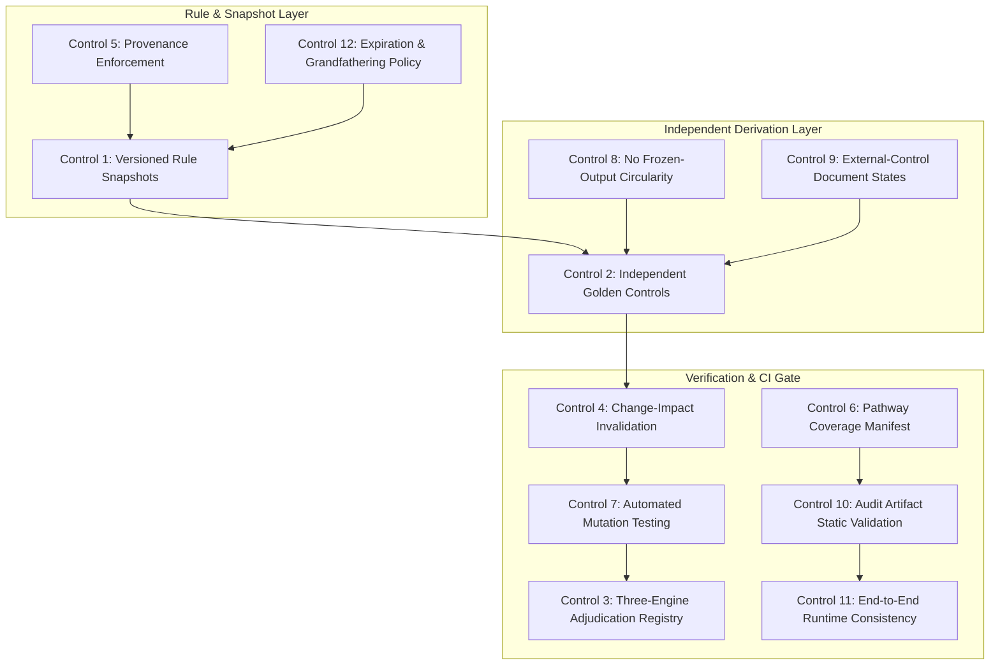

# CineGlobe Permanent Calculation Acceptance Controls
**Document Status:** Complete Architecture & Implementation Specification  
**Authority:** CineGlobe Calculation Integrity & Multi-Engine Verification Gate  
**Owner:** Independent Audit & Calculation Control Group (Codex / AG / Claude)  
**Effective Date:** 2026-10-09  

---

## 1. Executive Summary & Purpose

The CineGlobe optimizer engine evaluates production locations, statutory tax credits, cash rebates, bilateral treaties, and co-production stacks across global jurisdictions. Previous engineering cycles utilized a three-engine adjudication framework:
1. **Codex** independently researched statutes and calculated raw economics.
2. **Antigravity (AG)** independently calculated project-level budgets and statutory line classifications.
3. **Claude / Chat** adjudicated discrepancies, authored canonical implementations, and reviewed backend consistency.

However, subsequent code refactors (e.g., California Program 4.0 rate increases, QPE cap handling, portfolio globe aggregations) introduced regression tests that hardcoded previously served engine outputs as frozen regression constants. When statutory definitions or evaluator logic shifted, the tests continued to pass because they merely checked internal consistency against stale outputs, completely bypassing independent project-level derivation.

This document establishes **Twelve Machine-Enforced Permanent Controls** designed to ensure that no future parser, classification, rule, evaluator, or UI modification can bypass independent calculation verification.

---

## 2. The Twelve Permanent Machine-Enforced Controls



---

### Control 1: Versioned Rule Snapshots
* **Requirement:** Every statutory incentive calculation must explicitly record and bind to a versioned program snapshot defining the exact legal generation, effective start date, sunset date, and statutory amendment citation.
* **Separation of Timelines:** The engine must strictly decouple:
  1. `AS_OF_CONTROL_DATE`: Evaluated using the program generation, rates, caps, and guidelines in force on the project's budget/application date.
  2. `CURRENT_LAW_AS_OF_AUDIT_DATE`: Evaluated using currently active legislation for hypothetical prospective opportunities.
* **Schema Contract:**
  ```python
  class ProgramRuleSnapshot(BaseModel):
      program_id: str
      program_generation: str  # e.g., "California Program 3.0" vs "California Program 4.0"
      statutory_citation: str  # e.g., "Cal. Rev. & Tax Code § 17053.98"
      effective_date: date
      sunset_date: Optional[date]
      rate_floor: Decimal
      rate_ceiling: Decimal
      project_cap_usd: Optional[Decimal]
      atl_qualified: bool
      nonresident_cast_qualified: bool
      nonresident_crew_qualified: bool
      minimum_spend_usd: Decimal
      claim_base_type: str  # ALL_SPEND, LOCAL_BTL, LABOUR_ONLY, etc.
  ```
* **Enforcement:** Calculations lacking an explicit `snapshot_version` fail at runtime. Retroactive evaluation of future program generations against historical projects without an explicit disclosure flag raises `TemporalRuleMismatchError`.

---

### Control 2: Independent Golden Controls
* **Requirement:** All golden test fixtures must be derived from raw project budget line items and primary statutory texts, completely independent of CineGlobe backend evaluator code.
* **Prohibition of Circularity:** Expected values must never be populated by copying `canonical_evaluation.py` outputs, `StructureCalculationResult` database rows, or served API JSON payloads.
* **Golden Fixture Schema:**
  ```json
  {
    "fixture_id": "GOLDEN-BH-BASELINE",
    "project_title": "Bad Hombres",
    "budget_source": "BadHombresBudget.v2.pdf",
    "raw_budget_gross_usd": 2482023.00,
    "statutory_exclusions_usd": 1711752.00,
    "expected_qpe_usd": 770271.00,
    "statutory_rate": 0.2500,
    "expected_confirmed_incentive_usd": 192567.75,
    "expected_confirmed_npc_usd": 2289455.25,
    "primary_authority": "NMSA 1978 § 7-2F-1",
    "derivation_author": "AG-INDEPENDENT-CALCULATION-DESK"
  }
  ```

---

### Control 3: Three-Engine Adjudication Registry
* **Requirement:** Every canonical calculation rule, statutory rate, cap, and qualification interpretation must be recorded in a cryptographically signed Adjudication Registry.
* **Adjudication Ledger Contract:**
  ```python
  class AdjudicationRecord(BaseModel):
      record_id: str
      rule_or_fixture_target: str
      codex_independent_finding: Dict[str, Any]
      ag_independent_finding: Dict[str, Any]
      discrepancy_explanation: str
      adjudicated_canonical_value: Dict[str, Any]
      adjudicating_engine: str
      adjudication_timestamp: datetime
      associated_code_commit: str
      superseded_by: Optional[str] = None
  ```
* **Expiration on Modification:** Any commit modifying a referenced calculator, parser, or rule file automatically invalidates all associated adjudication records and marks them `PENDING_RE_ADJUDICATION`.

---

### Control 4: Change-Impact Invalidation & Dependency Graph
* **Requirement:** An automated git pre-commit / CI hook maps all code files to downstream golden controls.
* **Dependency Mapping Matrix:**
  * Changes to `backend/app/calculators/allocation_pricing.py` invalidates all 400 scenario golden controls.
  * Changes to `backend/app/data/program_rate_rules.py` invalidates all golden fixtures referencing modified programs.
  * Changes to `backend/app/services/budget_spend_classifier.py` invalidates all 158 line-classification fixtures.
  * Changes to `backend/app/calculators/program_stacking_rules.py` invalidates all multi-program hybrid fixtures.
* **CI Gating:** PRs cannot merge if any invalidated control has not been rerun and passed.

---

### Control 5: Provenance Enforcement
* **Requirement:** No incentive program or rate rule may be marked `AUTHORITY_VERIFIED_PRICEABLE` without retained primary legal documentation.
* **Mandatory Provenance Fields:**
  1. Governing statute / legislative bill number.
  2. Administrative regulations / operational guidelines.
  3. Official application form / instructions.
  4. Current administering film commission or tax authority URL.
  5. Verified primary document hash stored in `docs/provenance/`.
* **Prohibition:** Modeling heuristic approximations or ungrounded estimates cannot be labeled `AUTHORITY_VERIFIED`.

---

### Control 6: Pathway Coverage Manifest
* **Requirement:** Every distinct calculation pathway in the production optimizer must be represented by at least one independent golden test fixture.
* **Minimum Required Pathways:**
  1. `PATH-SINGLE-BASELINE`: Single-jurisdiction anchor.
  2. `PATH-RELOCATION-STANDALONE`: Single-jurisdiction full relocation.
  3. `PATH-COMPONENT-RELOCATION-2LEG`: Principal + remote component (Post/VFX).
  4. `PATH-HYBRID-2LEG`: Two-jurisdiction production hybrid.
  5. `PATH-HYBRID-3LEG-UPLIFT`: Three-jurisdiction hybrid with conditional rate ceiling.
  6. `PATH-HYBRID-3LEG-FLAT`: Three-jurisdiction hybrid with deterministic flat rate.
  7. `PATH-HYBRID-4LEG-MULTI`: Four-jurisdiction multi-leg production hybrid.
  8. `PATH-MULTI-PROGRAM-STACK`: Single-jurisdiction stacked incentives with spend reduction.
  9. `PATH-STACK-FED-PROV`: Federal + provincial stacking with assistance reduction.
  10. `PATH-COPRO-TREATY-OFFICIAL`: Official bilateral treaty co-production.
  11. `PATH-REJECTION-MINIMUM-SPEND`: Filtered by statutory minimum spend gate.
  12. `PATH-SELECTIVE-NON-PRICEABLE`: Discretionary/competitive grant filtered from deterministic pricing.
* **Enforcement:** If `canonical_evaluation.py` executes an unrepresented pathway, CI fails with `UncoveredCalculationPathwayError`.

---

### Control 7: Automated Mutation Testing Harness
* **Requirement:** CI must execute automated mutation testing that deliberately introduces statutory calculation errors to verify that test suites fail loudly.
* **Mandatory Mutation Targets:**
  1. *Rate Inflation:* Increase base credit by +1.0% -> Must fail.
  2. *Uplift Injection:* Grant unearned soundstage or rural uplift -> Must fail.
  3. *Contingency Inclusion:* Include unspent contingency in QPE -> Must fail.
  4. *Non-Resident Cast Leakage:* Qualify foreign lead cast in BTL program -> Must fail.
  5. *Stacking Double-Count:* Sum overlapping claim bases -> Must fail.
  6. *Ceiling Misclassification:* Substitute 80% budget ceiling for QPE -> Must fail.
  7. *Temporal Bleed:* Evaluate Program 4.0 rates on 2024 project -> Must fail.

---

### Control 8: No Frozen-Output Circularity Gate
* **Requirement:** Automated AST linter scanning all test modules (`tests/**/*.py`) to detect and reject hardcoded regression assertions that lack independent line-level derivations.
* **Rule:** If a test asserts `result.total_qpe_usd == Decimal('3614149.60')` without an explicit budget line summation formula, the linter rejects the test.

---

### Control 9: External-Control Document State Reconciliation
* **Requirement:** All project evaluations must explicitly classify external reference values into one of four mutually exclusive legal states:
  1. `HISTORICAL_FINAL_CERTIFICATE`: Certified post-audit tax credit certificate.
  2. `HISTORICAL_BINDING_RESERVATION`: Formal pre-allocation approval letter issued by government agency (e.g., California CFC CAL #8-053).
  3. `PRODUCER_BUDGET_ESTIMATE`: Preliminary planning figure from line producer budget topsheet.
  4. `CURRENT_LAW_MODELED_OPPORTUNITY`: Hypothetical future opportunity evaluated under current legislation.
* **Prohibition:** The UI and API must never present a `PRODUCER_BUDGET_ESTIMATE` or `CURRENT_LAW_MODELED_OPPORTUNITY` as a confirmed legal reservation or certified award.

---

### Control 10: Audit Artifact Static Validation Suite
* **Requirement:** Automated validator (`validate_independent_optimizer_audit.py`) running in CI to enforce:
  1. Exactly 100% compliance with the 8 mandatory data labeling categories.
  2. Exact arithmetic balance with $0.00 unexplained residuals across all variance bridges.
  3. Zero duplicate economic identities within any presentation surface.
  4. No missing canonical programs in reachability matrices.
  5. Negative controls suite proving the validator rejects all prohibited practices.

---

### Control 11: End-to-End Runtime Consistency
* **Requirement:** The economics served across all application surfaces must originate from a single canonical calculation kernel and remain mathematically byte-consistent:
  * Persisted Database Row (`structure_calculation_results`)
  * Project State API (`GET /api/v1/cineglobe/projects/{id}/state`)
  * Portfolio Globe API (`GET /api/v1/cineglobe/portfolio/globe`)
  * Overview Four Presentation Cards
  * Workspace Six Presentation Slots
  * Project & Company Interactive 3D Globes
  * Inspector Panel Details
* **Enforcement:** Automated integration test loads all 7 surfaces for all active productions and asserts exact penny parity for `confirmed_incentive_usd`, `potential_incentive_usd`, `confirmed_npc_usd`, and `potential_npc_usd`.

---

### Control 12: Expiration & Grandfathering Policy
* **Requirement:** All program rules and golden fixtures carry a mandatory 180-day review horizon and statutory sunset trigger.
* **Behavior:**
  * When a statute reaches its legislative sunset date or an amendment takes effect, all dependent current-law golden controls automatically expire.
  * Expired controls block CI deployment until refreshed by the multi-engine review desk.
  * Historical as-of-date controls remain immutable and permanently grandfathered.

---

## 3. Implementation Blueprint & CI Workflow

```yaml
# .github/workflows/calculation_integrity_gate.yml
name: CineGlobe Calculation Integrity Gate

on:
  pull_request:
    paths:
      - 'backend/app/calculators/**'
      - 'backend/app/data/**'
      - 'backend/app/services/**'
      - 'docs/validation/**'

jobs:
  verify_calculation_integrity:
    runs-on: ubuntu-latest
    steps:
      - uses: actions/checkout@v4
      - name: Set up Python
        uses: actions/setup-python@v5
        with:
          python-version: '3.11'
      - name: Install Dependencies
        run: pip install -r backend/requirements.txt
      - name: Run Independent Audit Artifact Validator
        run: python3 docs/validation/exhaustive_optimizer_audit/validate_independent_optimizer_audit.py
      - name: Run Mutation Testing Harness
        run: pytest tests/integrity/test_calculation_mutations.py
      - name: Verify Pathway Coverage Manifest
        run: python3 tests/integrity/verify_pathway_coverage.py
      - name: Verify End-to-End Runtime Parity
        run: pytest tests/integration/test_runtime_calculation_parity.py
```

---

## 4. Conclusion & Hand-off

The Twelve Permanent Controls specified above eliminate circular self-certification, prevent regression constants from masking statutory defects, enforce temporal precision between historical reservations and future opportunities, and guarantee that CineGlobe maintains mathematical and statutory rigor across every evaluated jurisdiction worldwide.
